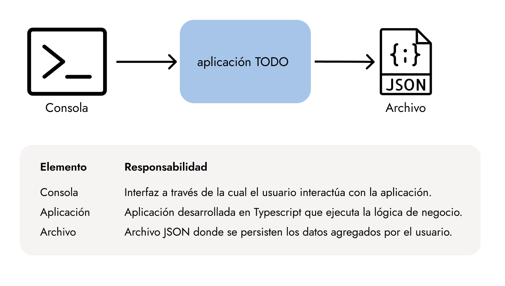

# Arquitectura Usabilidad

## Objetivo del proyecto
Este proyecto está diseñado para implementar y demostrar patrones de usabilidad en arquitecturas de software, enfocado en el uso del patrón "Undo".

### Implementación
A modo de ejemplo, implementamos una aplicación de TODOs que se ejecuta en la consola y, en última instancia, edita archivos JSON mediante una línea de comandos en NodeJS.



Las funcionalidades principales son:
- Ver todos los TODOs
- Agregar un TODO
- Modificar un TODO
- Eliminar un TODO
- Deshacer un cambio

Sobre el último punto, es importante destacar que el sistema permite al usuario retornar a un estado anterior a cuando se ejecutó una operación. Además, le permite deshacer los cambios en varios niveles. 
Esto significa que si el usuario ha realizado más de un cambio, puede elegir cuál de todos ellos quiere deshacer.

### Documentación

Registramos las principales decisiones de arquitectura tomadas por el equipo.

- [Elección de la tecnología](./documentacion/adr/eleccion-tecnologia.md)
- [Elección de la capa de presentación](./documentacion/adr/eleccion-capa-presentacion.md)
- [Elección del tipo de persistencia](./documentacion/adr/eleccion-persistencia.md)

### Atributos de calidad

Para el desarrollo de esta aplicación, consideramos principalmente los siguientes atributos de calidad:

- Usabilidad. 

Dado que es una aplicación de línea de comandos, es importante que los comandos sean intuitivos y la interacción sea sencilla. La capacidad de deshacer múltiples cambios otorga una flexibilidad adicional, mejorando la experiencia del usuario al permitirle elegir qué acción previa desea deshacer.

Sin embargo, sabemos que el uso y la ejecución de una aplicación de consola requiere de ciertos conocimientos específicos que no todos los usuarios porseen. Por lo tanto, creemos que sería una
posibilidad convertirla eventualmente en una aplicación web o mobile con una interfaz más amigable para todo tipo de usuarios.

- Testabilidad. 

Los tests de aceptación son un punto clave, ya que garantizan que la aplicación cumpla con los requisitos funcionales desde el punto de vista del usuario final. 
Esto también mejora la calidad del software y facilita la detección de errores o regresiones en el comportamiento de la aplicación. 
Además, es un paso vital si pensamos en futuras refactorizaciones del código para mejorar su escalabilidad y mantenibilidad.

- Escalabilidad. 

Aunque es una aplicación de consola, el uso de JSON para almacenar datos permite que el sistema sea adaptable a una posible integración con una base de datos o con interfaces más avanzadas en el futuro. 
Esto le da una base para escalar en términos de volumen de datos o número de usuarios si se convierte en una aplicación más compleja.


## Tecnologías Usadas

- NodeJS
- CucumberJS

## Pre-requisitos

Asegúrate de tener instaladas las siguientes herramientas:

- [NodeJS](https://nodejs.org/en) versión 20.18.0

## Instalación

Clona el repositorio e instala la dependencias:

```bash
git clone https://github.com/LPocay/arquitectura-usabilidad.git
cd arquitectura-usabilidad
npm ci
```

Correr los test:
```bash
npm run test
```

Correr la App:
```bash
npm run dev
```


## Autores

- [Sergio Daniel Risposi](https://github.com/srisposi)
- [Belén Fernandez Navarro](https://github.com/menosbel)
- [Luigi Pocay](https://github.com/LPocay)
